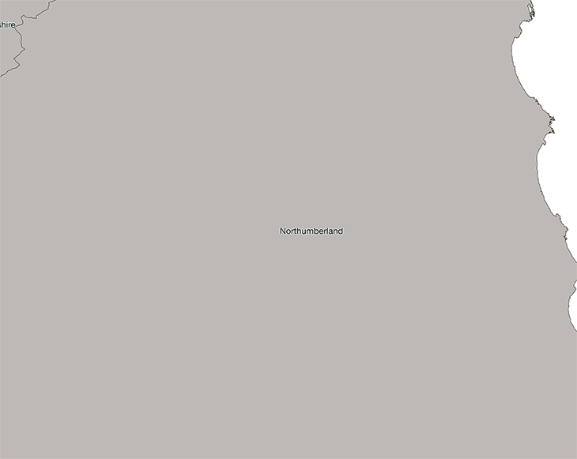

## Background

Like all motorcyclists, long winter nights are spent thinking about and planning rides for the season ahead. Over a pint in our local, well before the COVID-19 lockdown, we talked over various options. We both liked the idea of a project to explore and learn more about the UK. A germ of an idea was formed: a ride through every county of the UK, taking in as many recommended motorcycle routes as possible. (Perhaps we'll reach out to each local IAM group for recommendations.)

Several pints later, we were still pondering:

- How many counties are there?
- Historic counties or administrative boundaries?
- Can we find a road map showing all the historic county boundaries?
- Maybe we should we aim for the centre of each county?
- Where is the centre of each county? Where is the centre of Northumberland come to think of it?

Practically, if we were going to ride through the centre of each county (assuming we're not going to stretch our off-road skills to riding through open heath and moorland), we would need to aim for the towns, or villages nearest to the centre points. But how could we identify those places? Google searches for terms like 'geographic centre of UK counties' didn't yield answers that we could simply plug into our satnavs.

Being something of ~~a perfectionist~~ an obsessive (EDIT: Mary), I didn't want to settle for 'guesses' based on sticking pins in maps. After all, this just seemed like a problem of geometry.

So, I found myself embarking on a fascinating study of Geographic Information Systems, open GeoPackages and coordinate systems used to project a 3-D world onto a 2-D map surface. What I discovered is a treasure trove of powerful open-source software and freely licensed geodata sets. With a little investment of time, a couple of weekends, I found myself solving very practical route planning problems using techniques that are well beyond the capabilities of software that accompanies most motorcycle satellite navigation products.

The intention of this article is to document and share what I've learnt over the last few weeks and approaches that I have taken to solve a couple of route planning challenges. 

Whilst I was putting the finishing touches to our counties ride, in preparation for the new biking season, the COVID-19 outbreak hit the UK. The closure of cafés and restaurants was announced. Perhaps we need to plan routes that pass amenities like picnic tables and public toilets. I began to wonder how easy it would be to find their location and proximity using public geodata. This is what I found out.

## What is a GIS map?

Graphic Information Systems (GIS) software is used to build, present and analyse digital maps. 

After reading several online reviews of different GIS software, I decided to 'test-ride' [Quantum GIS](https://qgis.org/en/site/index.html "Go to QGIS website") (QGIS) (Version 3.10), a project of the Open Source Geospatial Foundation. QGIS is free (issued under a GNU General Public License) and compares favourably with industry-standard, commercial alternatives like [ESRI ArcGIS](https://www.esriuk.com/en-gb/home "Go to ESRI UK and Ireland website"). Whilst an annual individual, non-commercial license for ArcGIS, at less than £150, seems reasonable given its capabilities and availability across multiple devices, I decided to start with the free option widely used across academic and private organisations. 

Like Northumbria Advanced Motorcyclists, QGIS is maintained by a strong and active community of volunteers. 

### Building a GIS map

GIS maps are built in layers. The first layer will typically contain a base map, such as a street map. Layers containing different features of interest (towns, buildings, monuments, road junctions, national parks) are superimposed.

Features may be loaded from external files, imported from geospatial datasets or created and maintained directly within the GIS application itself. Features are represented by layers containing points, polygons (such as forest boundaries), vectors (roads and routes) and raster images (aerial or satellite photographs for example).

The following animation shows the build-up of layers within QGIS. Starting from an outline of Northumberland, roads are added onto which one of the many NAM [ride-out routes](/motorcycle-routes/ "Explore our motorcycle routes") is superimposed as a dashed line. Urban areas are drawn next, followed by individual buildings contained within those boundaries. Water features, wooded areas and national parks through which the route passes are then shown. Finally, the map is completed by the addition of contour lines and place names.

<figure>
  
  <figcaption class="font-weight-light font-italic">"Animation showing the construction of a custom map in QGIS."</figcaption>
</figure>

### Presenting a GIS map

With GIS software, there is complete freedom to colour, style and label features. For the examples shown on this page, I've chosen colours and styles which match the overall design of the namrider.com site. In practice, features, colours and styles would be chosen to make a custom map as easy to read as possible, depending what needs to be shown. 

It is worth mentioning that all images reproduced here are reproduced at low resolution (72 ppi) for illustrative purposes. They are not representative of detailed maps which can be printed or output as PDF documents from QGIS. 

### Analysing a GIS map

The ability to save multiple motorcycle routes and produce customised maps, highlighting only the key features needed, already seems a useful addition to standard satnav software. 

However, the real power of GIS applications lies in their processing toolkits; mathematical spanners and Allen keys that make it possible to draw insights from large geographic datasets relatively easily. This could be anything from determining the areas of shapes (buildings, parks, etc.) or selecting specific features based on their size (vector analysis), the distances between features or fastest route between points (network analysis) or estimating heights from an aerial photograph (raster analysis).

As with any software, there is a learning curve. It is necessary to set aside time to learn to navigate the QGIS interface and to know which of the processing algorithms to apply to which situations. There are many books and online tutorials available to assist. However, the [training manual from QGIS](https://qgis.org/en/docs/index.html "Go to QGIS documentation") is an excellent starting point, presenting step-by-step solutions to typical spatial analysis problems using real data. At almost 700 pages long, expect to spend a good weekend working through the examples. A gentle introduction to QGIS is also available.  

### Geospatial datasets

Before we can create and analyse our own maps, we need to find geospatial data to work with. It is amazing how much high quality, open geodata is now available, free to download and use in GIS applications. 

There are several sites that curate lists of commercial and free datasets. A couple of good examples are:

- [Free GIS data](https://freegisdata.rtwilson.com/#home "Go to Free GIS listing website")
- [Global GIS datasets](https://en.wikipedia.org/wiki/List_of_GIS_data_sources "Go to Wikipedia GIS data list")
- [The Historical GIS Research Network](http://www.hgis.org.uk/resources.htm "Go to the Historical GIS Research Network resource list")

Within the UK, successive governments have made great efforts to make [public data freely available](https://data.gov.uk "Go to UK Government open data portal") (to encourage developers and entrepreneurs to build solutions to business and social problems).

Like many, I've been using maps from Ordnance Survey (OS) for years (including a subscription to the excellent OS maps app). What I hadn't appreciated is how much [OS data](https://www.ordnancesurvey.co.uk/opendatadownload/products.html "Go to Ordnance Survey OpenData page") is free to view, download and use for commercial, education and personal purposes. This includes basemaps of Great Britain and coverage of the road network down to local level.

OpenStreetMap (OSM) is a comprehensive map of the world, based on information submitted by a global community of map enthusiasts. OSM data drives many websites and applications; data is free to use for any purpose under the [Open Database Licence](https://www.openstreetmap.org/copyright "Read the OSM copyright and license") as long as OSM and its contributors are credited.

[Openrouteservice](https://openrouteservice.org "Go to the Openrouteservice website") is being developed and provided by Heidelberg Institute for Geoinformation Technology (HeiGIT), based on the crowd-sourced geodata in OSM.

History is also brought to life with GIS datasets. The National Heritage List for England (NHLE) maintain a [register of all nationally protected historic buildings and sites in England](https://historicengland.org.uk/listing/the-list/ "Go to National Heritage List for England register"). Listed buildings, registered battlefields and scheduled monuments (including Hadrian's Wall) may all be downloaded as GIS shapefiles from NHLE.

## CASE STUDY 1: Planning a motorcycle trip to the centre of historic counties

Returning back to the original problem: how to plan a route through the centre of every historic county in the UK. After two days reading the QGIS manual, here's the approach I took.

### Mapping the Historic Counties

We start with the [Boundary-Line digital data](https://www.ordnancesurvey.co.uk/business-government/products/boundaryline "Go to Ordnance Survey Boundary-Line page") geopackage downloaded from Ordnance Survey (OS). Vectors describing the outline of the historic county boundaries in England, Scotland and Wales are imported into a QGIS project. Styles and colours are selected for readability and to blend with the rest of the website.



### Locating the centroids

Determining the geometric centre of the boundary 'shapes' is easy within QGIS. There are many native geoprocessing and geometry tools including 'Centroids' (Vector > Geometry Tools > Centroids). The centroid function creates a new point layer, each point representing the centre of the geometries in an input layer (in this case our historic boundaries).



### Towns and villages

The [OS Open Names](https://www.ordnancesurvey.co.uk/business-government/products/open-map-names "Go to Ordnance Survey Open Names page") is a large dataset updated quarterly and which contains, at the last count, names and locations of 44,000 of places and settlements, 1,600,000 postcodes and 870,000 road names and numbers. 

For the purposes of this route planning challenge, we need identify only towns, villages or settlements which are nearest to the historic centroids. After loading OS Open Names into the project, it is possible to apply a filter in QGIS and create a new points layer containing only towns and villages across the country.



### Calculating distances

In order to determine which settlement is nearest to each centroid we need to compute a distance matrix. The Distance Matrix (Vector > Analysis Tools > Distance Matrix) algorithm generates a table containing all the distances between centroid points and each of the locations in our towns and villages layer. In this case we only need to identify 1 nearest target point (town) per centroid.

At this stage the distance matrix identifies the centroid of each county and the identifier and location of its nearest settlement (one per historic county). In order to include names and other attributes (such as the type of settlement), it is necessary to join the distance matrix with the centroid and towns layers. Again, this is an easy operation within QGIS.

Another tool in the QGIS geoprocessing toolbox (Vector > Geoprocessing Tools > Intersection) allows us to identify towns (in the centroid/town matrix) which are also in the original towns and villages dataset. This may seem an unnecessary step, but it allows us to isolate centroids and destination towns in separate layers within the project. These can then be styled differently. The original geodata set containing all towns and villages country-wide may now be removed from the project.



We've now identified the destinations that we should put into our satnavs in order to ride as closely as possible to the centre of each historic county. We've also learned:

- The centre of historic Northumberland is very close to Elsdon
- The village of Welwyn, Hertfordshire is closer to its counties' centre than any other settlement in the UK
- The hamlet of Ardessie, Ross and Cromarty, is furthest away from its counties' centre

We could stop there but there are even more powerful analytic capabilities under the hood of QGIS.

### Travelling salesman

It's a classic logistics problem: how to plan a trip through a given number of stop-off points minimizing time and fuel. The mathematics involved is quite complex, but I'd read a number of posts indicating that it was possible to carry out a so-called 'travelling salesman' analysis using QGIS. I decided to try and see if I could calculate an optimum route though the towns and villages I'd identified.

From a practical point of view, we're probably going to need to break this trip into segments that can be ridden within a week or two. My first attempt at a travelling salesman analysis is going to focus on Scotland.

In order to carry out a travelling salesman analysis there are two pre-requisites: we need a 'network' to travel along and we need a set of destination points that are connected to that network.

The [Ordnance Survey Open Roads](https://www.ordnancesurvey.co.uk/business-government/products/open-map-roads "Go to the Ordnance Survey Open Rods page" ) dataset contains details of all UK roads and intersections. All motorways, regional and local roads are included along with road names, numbers and classifications.

For the purposes of this trip, given the distances involved, I'm going to assume that we will travel using regional roads and motorways (if necessary). We can create a subset of the OS Open Roads by filtering out local roads. This will also reduce the calculation time required.



Looking at our destination points and road network, it becomes apparent that there is a problem. Some of the towns and villages identified are disconnected from the network of regional roads. Bedrule in Roxburghshire, for example, sits between the B6357 and A698. (We decided to ride on national and regional roads; the local roads which run through Bedrule were excluded from the dataset used in this case study.)

After some further research, this problem was quickly solved in QGIS with a couple of housekeeping steps:

- Convert destination towns (multipoint layer) to point layer using 'Convert Geometry Type' (Processing Toolbox > Vector Geometry > Convert Geometry Type)
- 'Snap' the towns to the nearest point on the national/regional road network using the 'Snap Geometries to Layer' tool. (Processing Toolbox > Vector Geometry > Snap Geometries to Layer).



Geographic Resources Analysis Support System (GRASS) is another open source GIS project containing a wide array of powerful functions, including a travelling salesman implementation (v.net.salesman). These functions are directly available within QGIS.

However, my first attempts at calculating a route based on my destinations and road network failed. The algorithm was repeatedly failing and returning somewhat cryptic messages about points being unreachable. Reflecting on the problem overnight it then occurred to me that my destinations included villages in Shetland, Orkney and Bute that, of course, are not reachable by the road network. (I'm sure it would be possible to locate a geodata set that includes ferry routes that could be used to extend the road network.)

After removing island destinations, the v.net.salesman function (Processing Toolbox > GRASS > v.net.salesman) worked like a charm, returning an optimised route after only a few minutes processing.





## CASE STUDY 2: Avoiding cafés and meeting places

The COVID-19 pandemic means it is imperative that rides (by individual members) avoid lunch stops in cafés, many of which will now be closed. It may be necessary to plan routes which take in public conveniences on the way.

Can we easily identify the location of public toilets and picnic tables that are within, say, a 90-minute ride from a starting point at Seaton Burn? How many of those are also situated near a petrol station?

Many open datasets are now accessible via APIs (application programming interfaces). These interfaces describe the protocols by which applications can exchange data. It may be necessary to register for a 'key'. Some datasets may have both free and paid access tiers; restrictions may apply to free tiers such as the number of access requests allowed per second or the maximum time for which a large query is allowed to run. However, none of this is difficult as it might sound. 

Like isobars showing areas of equal pressure on a weather map, isochrones show areas on a GIS map that could be covered in a given timeframe. There are several ways to calculate isochrones within QGIS. (Methods vary in sophistication and whether or not they take into account factors such as speed limits on the road network.) One of the quickest and easiest is using the [TravelTime plug-in](https://www.traveltimeplatform.com/blog/isochrone-qgis-plugin-traveltime "Go to the TimeTravel website") and API. It takes a few minutes to register an account and request an API key, but it is then incredibly easy to generate isochrones simply by selecting a start location, journey time and mode of travel.

The following example shows 60- and 90-minute driving isochrones based on an origin at Seaton Burn services and overlayed with the the entire OS Road network.



By subtracting one area from the other using the Difference tool (Vector > Geoprocessing Tools > Difference), we can identify possible locations after riding for 60 to 90 minutes.



QGIS has a 'Quick OSM' plugin which makes it very easy to query Open Street Map geodata (without the need to know or understand the technicalities of its Overpass API). A quick read of the [Open Street Map wiki](https://wiki.openstreetmap.org/wiki/Tag:amenity%3Dfuel "Go to Open Street Map wiki") to check how amenities like picnic tables are identified (or tagged), and these data points are imported into our QGIS project as dedicated layers.



The same intersection tool used earlier (Vector > Geoprocessing Tools > Intersection) allows us to isolate picnic tables which fall within our 60 to 90-minute riding range.



Using the same techniques, it is also possible to extract and show the locations of amenities like public toilets and petrol stations.

Given the large number involved, it was not possible to extract the full list of fuel stations for the entire UK in one query. But the Quick OSM plugin makes it easy to restrict the query to only the area of the country visible on screen (the 'canvas'). After zooming into to north of the country, a query to extract all fuel stations that could be accessed in a day's ride from Seaton Burn completed without any issues.



Using the methods described in CASE STUDY 1, it would be possible to identify picnic tables which are located within specific distances of both picnic tables and filling stations. In this case, however, I have used the QGIS feature selection tool to identify 3 possible locations near to the other amenities and away from conurbations.

From each of the possible first stop-off points, we can calculate further 90-minute isochrones covering routes back to Seaton Burn or exploring further afield.



Hopefully it won't be long before pandemic-mitigating restrictions are lifted and we will be able to social rides to cafés and other destinations once again. The GIS analysis techniques explored here can, of course, be used to plan routes to historic sites or other landmarks via classic motorcycle roads.

## Where next?

Finding and working with such high-quality software and geodata, curated and maintained by legions of passionate volunteers, has inspired me. I will find an open-source project to contribute to during my retirement (still a little way off and not until I have enough saved for a new bike). 

In the meantime, I will continue to dig deeper into GIS to learn more about our geography and history and to solve motorcycle route planning challenges. Perhaps I will curate a geopackage containing all NAM ride-outs for others to integrate into their GIS maps. At coffee stops and events you may see me trying to send updates to Open Street Maps to improve the quality of data for other riders and map users.

I have found exploring and mapping geodata sets to be a lot of fun and a fascinating way to learn more about the world around me. I'm tempted to sign up for an ESRI ArcSoft license for a year and see how that compares with QGIS for planning motorcycle journeys within the UK and abroad. Perhaps the subject of another article. 

Obsessive? Me?



